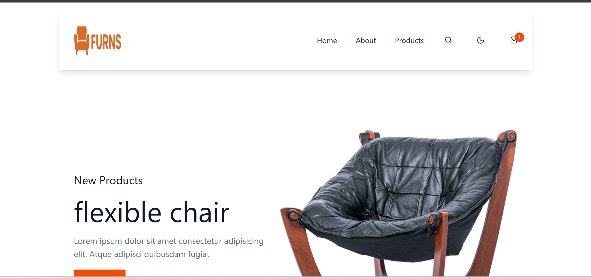

 # 🛍️ Modern E-Commerce Store


## ✨ Features

### Product Showcase
- 📋 Dynamic product listings from FakeStoreAPI
- 🔍 Advanced filtering (category, price range)
- 🔄 Multiple sorting options (price, name)
- 🖼️ Responsive product card grid

### Theme System
- 🌓 Light/Dark mode toggle
- 💾 Persistent theme preferences
- 🤖 Automatic OS theme detection
- 🎨 Theme-aware UI components

### Shopping Experience
- 🛒 Add-to-cart functionality
- 🔢 Quantity management
- 🔴 Real-time cart counter

### Responsive Design
- 📱 Mobile-first approach
- 🖥️ Adaptive layouts for all devices
- 👆 Touch-friendly interactions

## 🛠️ Tech Stack

| Category        | Technologies                          |
|-----------------|---------------------------------------|
| Core            | React, React Router                   |
| Styling         | Tailwind CSS                          |
| Icons           | React Icons (Feather)                 |
| State Management| Context API                           |
| API             | FakeStoreAPI                          |

## 🚀 Getting Started

1. Clone the repo
   ```bash
   git clone https://github.com/Nasrah-muse/FURNS-E-Commerce.git